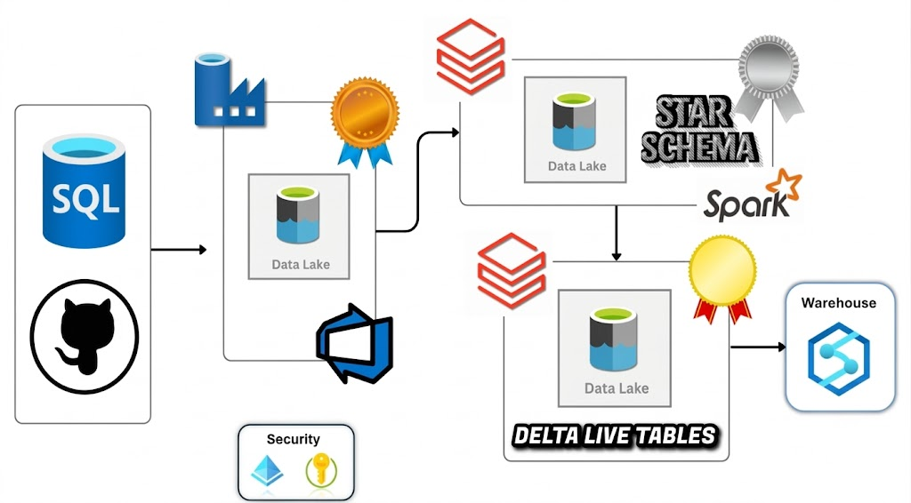

#  Spotify End-to-End Data Engineering Lakehouse ProjectCovering Azure

## 📌 Project Overview
This project implements a scalable **Spotify Data Lakehouse** on Microsoft Azure. It handles incremental data ingestion, automated quality checks, and unified data governance. The architecture transitions from a SQL source to a **Medallion Architecture** using modern tools like **Azure Databricks Unity Catalog**, **Autoloader**, and **DABs (Databricks Asset Bundles)**.

## 🏗 System Architecture
**Azure SQL ➡️ ADF (Incremental) ➡️ ADLS Gen2 (Bronze) ➡️ Databricks Autoloader (Silver) ➡️ DLT & SCD Type 2 (Gold)**

## 🛠 Advanced Tech Stack
* **Orchestration:** Azure Data Factory (Metadata-driven), Logic Apps (Email Notifications)
* **Storage:** ADLS Gen2 (Medallion Architecture: Bronze, Silver, Gold)
* **Governance:** Unity Catalog (Metastore, Managed Identities, Access Connectors)
* **Compute:** Azure Databricks (Autoloader, Structured Streaming)
* **Development:** Databricks Asset Bundles (DABs), Jinja2 Templating
* **Database:** Azure SQL Database

## 🚀 Key Technical Features

### 1. Robust Incremental Ingestion (ADF & Logic App)
* **Dynamic Watermarking:** Built an incremental pipeline that fetches only new records based on a `Last_CDC_Date` stored in a configuration file.
* **Metadata Automation:** Used **For-Each Loops** and **Array Parameters** to iterate through multiple tables dynamically.
* **Error Handling:** Integrated **Azure Logic Apps** to trigger instant email notifications for pipeline success or failure.

### 2. Enterprise Data Governance (Unity Catalog)
* **Identity Management:** Used **Azure Access Connectors** and **Managed Identities** for secure, password-less authentication to ADLS Gen2.
* **Metastore Organization:** Configured a **Spotify Metastore** in Unity Catalog with external locations for Bronze, Silver, and Gold layers to ensure fine-grained access control.

### 3. Modular Processing & Autoloader
* **Autoloader (Cloud Files):** Implemented Databricks Autoloader for Silver layer ingestion, ensuring:
    * **Schema Evolution:** Automatic detection of new columns.
    * **Idempotency:** Preventing duplicate data processing via checkpoints.
* **Reusable Utility Classes:** Created a `transformation.py` utility module containing object-oriented Python classes for common tasks like `drop_columns` and schema formatting.

### 4. Advanced Modeling (Gold & SCD Type 2)
* **Jinja2 Templating:** Developed a metadata-driven notebook using **Jinja2** to generate dynamic SQL for complex multi-table joins, making the code completely reusable for new dimensions.
* **DLT & SCD Type 2:** Built a **Gold Pipeline** using Spark Declarative Pipelines (DLT) to implement **Slowly Changing Dimension (Type 2)** for the `dimUser` table to track historical changes.
* **Data Quality (Expectations):** Applied **DLT Expectations** (Data quality constraints) on source tables to ensure only clean data reaches the analytical layer.

---

## 📊 Data Model (Star Schema)
The final Gold layer consists of:
* **Fact Table:** `factStream` (Streaming metrics)
* **Dimension Tables:** `dimArtist`, `dimTrack`, `dimUser` (SCD Type 2), `dimDate`

---

## Conclusion
This roject showcases a production-ready data engineering pipeline with scalability, automation, and real-time processing capabilites.